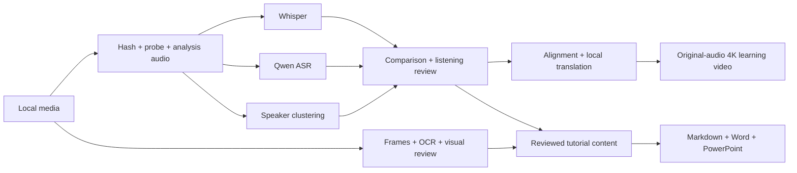
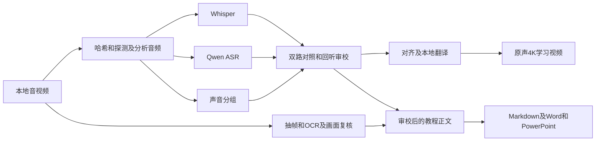

# Polyglot Media Workbench

[](https://github.com/KietC/polyglot-media-workbench/actions/workflows/ci.yml)
[](LICENSE)
[](pyproject.toml)

**Turn an existing recording or video into a timestamped transcript, then optionally make bilingual learning materials.**

[English](#english) · [简体中文](#简体中文) · [Setup / 配置](docs/SETUP.md) · [Troubleshooting / 排错](docs/TROUBLESHOOTING.md)

## English

Use Polyglot Media Workbench to review a recorded meeting or interview, study a foreign-language recording, or turn a screen-recorded tutorial into learning materials. You supply an existing audio/video file. The workbench keeps two recognizers' results separately so you can compare them and listen to uncertain passages.

### Choose your task

| What you need | Input → output | Entry point |
| --- | --- | --- |
| **Read and review a recording** | Local audio/video → timestamped Whisper/Qwen results, voice groups, disagreement marks and `transcript.md` | `run` |
| **See what appeared on screen** | Local video → original-size PNG frames, timestamps and optional screen-text extraction | `frames`; optional `vision` |
| **Make a learning video or document** | Reviewed timed cues or editorial content → bilingual 4K video, Markdown, Word or PowerPoint | `translate`, `study-video` or `documents` |

**Invented example:** a short recording says “Open the settings panel.” The workbench saves both recognition results and their audio time range. After listening review, you can add `打开设置面板。` as the Chinese text and make a study video with the original audio. A Word/PPT tutorial requires a separately reviewed content file; raw recognition is not automatically a finished tutorial.

### Real platforms and tools used

| Platform or tool | How this workflow uses it |
| --- | --- |
| **Windows + NVIDIA CUDA** | The recorded GPU smoke-test environment. Windows/Linux run the CLI; Linux/WSL is the documented option for the separate translation server. See [actual validation scope](docs/VALIDATION.md). |
| **Hugging Face and ModelScope** | Download model checkpoints explicitly, then run from local model/cache folders. The repository does not redistribute weights. |
| **Whisper via faster-whisper, and Qwen3-ASR** | Two separate speech-to-text passes; Qwen3-ForcedAligner optionally refines text/audio alignment. |
| **3D-Speaker, CAMPPlus and FSMN VAD** | Group voice intervals in one recording. A voice group is not a verified person identity. |
| **RapidOCR (PP-OCR ONNX) and InternVL3** | Optional screen-text extraction and local frame interpretation. The [frame module](src/media_workbench/vision.py) loads RapidOCR; the [OCR reference](recipes/vision/frames_ocr_reference.py) records the PP-OCR ONNX engine. |
| **vLLM + a local Qwen3 translation model** | Optional translation through a local service bound to loopback, using an OpenAI-compatible chat-completions interface. |
| **yt-dlp** | Optional acquisition from URLs supported by the installed downloader, such as a supported YouTube URL. This is a general downloader, not a dedicated account or conversation adapter; real download availability is not part of the release certification. |
| **FFmpeg, Microsoft Word and PowerPoint formats** | FFmpeg handles media and original-audio study videos. `python-docx`/`python-pptx` create editable files; installed Microsoft Office is optional for native export and layout review. |
| **Codex / an agent skill** | The development and assisted operating context. The [local media skill](skills/asr-local-4in1/SKILL.md) gives an assistant the processing/review order; ordinary CLI use does not require Codex. |

The names above describe dependencies, output formats and operating contexts, not affiliation. Model setup and each tool's license remain separate; see [third-party notices](THIRD_PARTY_NOTICES.md).

### What it adds after transcription

Optional stages add forced alignment, translation, OCR, local visual interpretation, 4K rolling captions and editable documents. Install only the stages you need.

English and German stay in the original transcript. Cantonese stays in the source transcript; its learning captions can be rewritten in standard written Mandarin. Original audio is copied into study videos and compared after muxing. A new caption appears below the previous dialogue, which moves up rather than disappearing immediately.

This repository contains generic processing code, synthetic examples and a reusable agent skill. Supply your own media, models, reviewed text, glossary and images locally. Models are downloaded separately under their own licenses.

### Start here

1. Read [the exact setup order](docs/SETUP.md), including Python, FFmpeg, CUDA and model preparation.
2. Install only the components needed for your task.
3. Run `doctor`; resolve missing tools and the required models before inference.
4. Start with a short non-sensitive clip, then process the whole file.
5. Review marked text against the original audio before using it in a tutorial.

**Smallest first task:** install the base CLI and run `media-workbench --help`. For a real recording, prepare the required models and start with `run --stages whisper qwen` on a short clip. For an already reviewed article, choose `documents` instead; that route does not need ASR models.

### Minimal installation

Use **Python 3.10–3.12**; these examples select Python 3.12 explicitly. Install that interpreter first if it is unavailable. Do not let an unrelated global Python 3.13+ create this environment.

**Windows PowerShell, from a new working directory:**

```powershell
git clone https://github.com/KietC/polyglot-media-workbench.git
Set-Location polyglot-media-workbench
py -3.12 -m venv .venv
& .\.venv\Scripts\python.exe -m pip install --upgrade pip
& .\.venv\Scripts\python.exe -m pip install -e .
& .\.venv\Scripts\media-workbench.exe --help
```

**Linux/macOS, from a new working directory:**

```bash
git clone https://github.com/KietC/polyglot-media-workbench.git
cd polyglot-media-workbench
python3.12 -m venv .venv
.venv/bin/python -m pip install --upgrade pip
.venv/bin/python -m pip install -e .
.venv/bin/media-workbench --help
```

These commands do not require activation or a global pip installation. Stay in the repository root and use the **same `.venv`** for all later installs and commands. The following English Bash examples use `.venv/bin/media-workbench`; in PowerShell use `& .\.venv\Scripts\media-workbench.exe` with the same arguments, as shown in the Chinese examples below.

The base CLI has no model dependencies. To run ASR, install a suitable PyTorch build **in this environment first**, then `.venv/bin/python -m pip install -e ".[asr,diar]"` (PowerShell: `& .\.venv\Scripts\python.exe -m pip install -e ".[asr,diar]"`). Follow [SETUP.md](docs/SETUP.md) for exact commands and checks. GPU libraries must match your hardware; a driver showing a CUDA version does not prove that every Python library can load.

### First complete ASR run

Make a local copy of `config.example.json` named `local_config.json` and prepare the model folders listed in it. **No recording is bundled:** `input/example.wav` is a placeholder that does not exist in this repository. Provide your own short, non-sensitive recording at that path, or replace `--input` with its actual path before running. Likewise, replace example video/font paths when using later commands.

```bash
.venv/bin/media-workbench --config local_config.json doctor
.venv/bin/media-workbench --config local_config.json run --input input/example.wav --output outputs/example
```

The default sequence is `whisper → qwen → diar → fuse → export`. Add forced alignment with:

```bash
.venv/bin/media-workbench --config local_config.json run --input input/example.wav --output outputs/example --stages whisper qwen diar fuse align export
```

Results include `source.json`, a 16 kHz mono analysis copy, separate recognizer JSON, voice segments, comparison units, a progress/error file and `transcript.md`. `editorial_status: pending` means the text still needs listening review. Empty or corrupt results fail visibly.

### Other commands

Before the `documents` example, install its optional dependencies in the same environment:

```bash
.venv/bin/python -m pip install -e ".[documents]"
```

PowerShell equivalent: `& .\.venv\Scripts\python.exe -m pip install -e ".[documents]"`. Other task extras are `asr`, `diar`, `vision` and `download`, as declared in [pyproject.toml](pyproject.toml); their models/tools and installation order are in [Setup](docs/SETUP.md). Installing the base CLI alone does not install those extras.

| Goal | Command |
|---|---|
| Highest available video/audio | `.venv/bin/media-workbench download URL --output inputs/downloads` |
| Frames and OCR | `.venv/bin/media-workbench frames --input input/video.mp4 --output outputs/frames --ocr` |
| Local screen interpretation | `.venv/bin/media-workbench --config local_config.json vision --frames outputs/frames/frames.json` |
| Local translation | `.venv/bin/media-workbench --config local_config.json translate --input outputs/example/fuse.json --output outputs/example/translated.json` |
| Editable Word/PPT/MD | `.venv/bin/media-workbench documents --content examples/content.json --output outputs/documents` |
| 4K rolling captions | See the next example; use reviewed cue text and a bilingual font. |

```bash
.venv/bin/media-workbench --config local_config.json study-video \
  --input input/example.wav --cues outputs/example/translated.json \
  --output outputs/example/study.mkv --font /path/to/bilingual-font.ttf \
  --assets examples/assets.json
```

PowerShell uses backticks for continuation; keep its Windows `.venv` executable prefix and use the same arguments on one line if preferred. With NVIDIA hardware you may add `--codec h264_nvenc`. AAC sources generally need MP4 to retain their priming metadata; PCM sources usually need MKV. [Troubleshooting](docs/TROUBLESHOOTING.md) explains both cases and why audio hashes matter.

### How the pieces fit



### Scope and validation

- The main CLI is configurable and has CPU-only synthetic tests in CI. [VALIDATION.md](docs/VALIDATION.md) records the actual release checks separately from general setup advice.
- GPU models and optional document layouts are not universally certified across operating systems. Visible uncertainty is retained; automatic agreement is not a guarantee of accuracy.
- Stage cache keys include input hash, model files, configuration, dependency versions, code and relevant upstream files. Model hashing can take time; it prevents a new model from silently reusing old text.
- The `recipes/` directory preserves more detailed historical algorithms as generic, annotated reference material. Use the main CLI for the documented setup path; inspect recipe prerequisites before running a recipe.
- The core is MIT licensed. Vendored 3D-Speaker files keep Apache-2.0 and upstream notices. See [third-party notices](THIRD_PARTY_NOTICES.md).

### Choose the right project

These are complementary tools. This table is navigation; it does not promise an already validated automatic handoff between them.

| Your task | Project |
| --- | --- |
| Transcribe existing media or create reviewed learning materials | **Polyglot Media Workbench — this repository** |
| Show a compatible Xiaomi phone's already displayed captions on Windows | [Caption Relay](https://github.com/KietC/caption-relay) |
| Save and review one OKKI customer's communications and files | [CRM Evidence Workbench](https://github.com/KietC/crm-evidence-workbench) |
| Archive records from an adapted website or research public market leads | [Local Evidence Collector](https://github.com/KietC/local-evidence-collector) |
| Organize an exhibitor directory and research progress | [Exhibitor Research Archive](https://github.com/KietC/exhibitor-research-archive) |
| Investigate the manufacturer behind a product | [FactoryTrace](https://github.com/KietC/factorytrace) |

CRM media attachments can become local inputs after a supported handoff is implemented. Caption Relay instead transports screen text: its observation timestamps cannot be substituted for this workbench's audio positions.

### Documentation

- [Configuration and complete operating order](docs/SETUP.md)
- [Pitfalls and concrete remedies](docs/TROUBLESHOOTING.md)
- [Architecture, files and schemas](docs/ARCHITECTURE.md)
- [Release validation](docs/VALIDATION.md)
- [Changelog](CHANGELOG.md)
- [README structure references](docs/README_DESIGN.md)
- [Agent skill](skills/asr-local-4in1/SKILL.md)
- [Contributing](CONTRIBUTING.md) · [Security](SECURITY.md)

## 简体中文

**把现有录音或视频整理成带时间段的文字，再按需要制作双语学习材料。**

适合回听会议或访谈、学习外语录音、整理录屏教程。你提供已有的音频或视频，工作台分别保留两套识别结果，方便比较分歧并回听不确定的内容。

### 先选你要做的事

| 你需要什么 | 输入 → 产出 | 使用入口 |
| --- | --- | --- |
| **读懂并复核一段录音** | 本地音视频 → 带时间段的 Whisper/Qwen 识别、声音分组、分歧标记与 `transcript.md` | `run` |
| **看清录屏中出现了什么** | 本地视频 → 原尺寸 PNG、画面时间及可选的文字提取 | `frames`；按需 `vision` |
| **做学习视频或文档** | 审校后的字幕时间段或编辑正文 → 双语 4K 视频、Markdown、Word 或 PowerPoint | `translate`、`study-video` 或 `documents` |

**虚构示例：**录音说了 “Open the settings panel.”，工作台保留两路识别和对应的音频时间段。回听确认后，可以加上中文 `打开设置面板。`，制作保留原声的学习视频。Word/PPT 教程需要另行审校的正文文件，原始转写不会自动变成完成的教程。

### 实际用到了哪些平台和工具

| 平台或工具 | 在这套流程中的用途 |
| --- | --- |
| **Windows + NVIDIA CUDA** | 已记录的 GPU 冒烟测试环境。CLI 可在 Windows/Linux 运行；单独翻译服务的文档路线使用 Linux/WSL。[实际验证范围](docs/VALIDATION.md)另行列明。 |
| **Hugging Face、ModelScope** | 明确下载模型后，从本地模型和缓存目录推理；仓库不分发模型权重。 |
| **Whisper / faster-whisper、Qwen3-ASR** | 分别转写同一音源；可选 Qwen3-ForcedAligner 细化文字与原声的时间对应。 |
| **3D-Speaker、CAMPPlus、FSMN VAD** | 在同一录音内分组声音区间，声音编号不代表已核实的人物身份。 |
| **RapidOCR（PP-OCR ONNX）、InternVL3** | 可选画面文字提取与本地识图。[抽帧模块](src/media_workbench/vision.py)加载 RapidOCR，[OCR 参考脚本](recipes/vision/frames_ocr_reference.py)记录使用 PP-OCR ONNX 引擎。 |
| **vLLM + 本地 Qwen3 翻译模型** | 可选绑定本机回环地址的翻译服务，采用 OpenAI 兼容的 chat-completions 接口。 |
| **yt-dlp** | 按需获取当前下载器支持的网址，例如可支持的 YouTube 网址。它是通用下载器，不是特定账户或聊天适配器；发布验收未认证真实网站下载可用性。 |
| **FFmpeg、Microsoft Word / PowerPoint 文件格式** | FFmpeg 处理媒体和原声学习视频；`python-docx`/`python-pptx` 生成可编辑文档。安装 Microsoft Office 仅用于可选原生导出及排版复核。 |
| **Codex / Agent Skill** | 开发及辅助操作环境。[本地媒体 skill](skills/asr-local-4in1/SKILL.md)为助手提供处理和审校顺序，普通 CLI 使用不要求安装 Codex。 |

这些名称说明依赖、输出格式和运行环境，不表示合作或隶属关系。模型准备与各工具许可分别处理，见[第三方说明](THIRD_PARTY_NOTICES.md)。

### 转写以后还能做什么

按需增加强制对齐、翻译、OCR、本地识图、4K 滚动字幕和可编辑文档。只安装本任务需要的模块。

英语、德语保留原文。粤语原话保留在底稿中，学习字幕可转普通话书面表达。学习视频复制原声音轨，封装后核对音频包和解码PCM；新对话放在下方，之前的对话向上移动，不会立即消失。

仓库只包含通用处理代码、合成示例与可复用skill。媒体、模型、审校正文、术语表和配图由使用者在本地提供。模型单独下载，适用各自许可。

### 正确开始顺序

1. 先阅读[详细配置顺序](docs/SETUP.md)，依次准备Python、FFmpeg、CUDA和模型。
2. 按任务安装所需模块，先装匹配的PyTorch，再装ASR等扩展。
3. 执行`doctor`，解决命令缺失和本任务所需模型缺失。
4. 用不敏感的短音频试跑，确认正常后处理完整文件。
5. 对照原声检查待核区间，之后再编写教程或学习字幕。

**最短起步：**安装基础 CLI 后先执行 `media-workbench --help`。要处理真实录音，配置所需模型后，用短片段执行 `run --stages whisper qwen`。已有审校文章要生成文档时，直接选择 `documents`，无需加载 ASR 模型。

### 最小安装

要求 **Python 3.10–3.12**，以下明确使用 Python 3.12。缺少时先安装该解释器，不要用电脑上的全局 Python 3.13 或更高版本创建本项目环境。

**Windows PowerShell：从新的工作目录开始。**

```powershell
git clone https://github.com/KietC/polyglot-media-workbench.git
Set-Location polyglot-media-workbench
py -3.12 -m venv .venv
& .\.venv\Scripts\python.exe -m pip install --upgrade pip
& .\.venv\Scripts\python.exe -m pip install -e .
& .\.venv\Scripts\media-workbench.exe --help
```

**Linux/macOS：从新的工作目录开始。**

```bash
git clone https://github.com/KietC/polyglot-media-workbench.git
cd polyglot-media-workbench
python3.12 -m venv .venv
.venv/bin/python -m pip install --upgrade pip
.venv/bin/python -m pip install -e .
.venv/bin/media-workbench --help
```

无需激活，也不用全局 pip。后续保持在仓库根目录，所有安装和运行都使用**同一 `.venv`**。下面的 PowerShell 示例使用 Windows 路径；Linux/macOS 将程序前缀换为 `.venv/bin/media-workbench`，安装依赖时使用 `.venv/bin/python`。

基础 CLI 不加载模型。识别任务先在这个环境中安装适合本机的 PyTorch，再执行 `& .\.venv\Scripts\python.exe -m pip install -e ".[asr,diar]"`。完整命令及验证方法见[SETUP.md](docs/SETUP.md)。`nvidia-smi`显示 CUDA 版本，不代表 Python 中的 CUDA 库一定可以加载。

### 第一次完整识别

将 `config.example.json` 复制为 `local_config.json`，先下载并配置模型目录。**仓库不带录音：**`input/example.wav` 是占位路径，仓库中不存在这个文件。先将你自己的不敏感短录音放到该位置，或者把 `--input` 改成真实文件路径，再执行命令。后面的示例视频和字体路径也要按本机实际情况替换。

```powershell
& .\.venv\Scripts\media-workbench.exe --config local_config.json doctor
& .\.venv\Scripts\media-workbench.exe --config local_config.json run --input input/example.wav --output outputs/example
```

默认顺序为`Whisper → Qwen → 说话人分离 → 双路对照 → MD`。需要强制对齐时：

```powershell
& .\.venv\Scripts\media-workbench.exe --config local_config.json run --input input/example.wav --output outputs/example --stages whisper qwen diar fuse align export
```

输出包括原媒体记录、16kHz单声道分析副本、两路识别JSON、声音分组、对照单元、进度/失败记录和`transcript.md`。`editorial_status: pending`表示仍需回听；空结果、损坏结果会报错。

### 后续处理

执行 `documents` 示例前，先在同一虚拟环境安装文档扩展：

```powershell
& .\.venv\Scripts\python.exe -m pip install -e ".[documents]"
```

Linux/macOS 对应 `.venv/bin/python -m pip install -e ".[documents]"`。其他任务扩展名为 `asr`、`diar`、`vision`、`download`，以 [pyproject.toml](pyproject.toml) 的声明为准；模型、外部工具及安装顺序见[配置指南](docs/SETUP.md)。仅安装基础 CLI 不会装齐这些扩展。

| 目标 | 命令 |
| --- | --- |
| 获取最高可用音视频 | `& .\.venv\Scripts\media-workbench.exe download URL --output inputs/downloads` |
| 抽帧与 OCR | `& .\.venv\Scripts\media-workbench.exe frames --input input/video.mp4 --output outputs/frames --ocr` |
| 本地识图 | `& .\.venv\Scripts\media-workbench.exe --config local_config.json vision --frames outputs/frames/frames.json` |
| 本地翻译 | `& .\.venv\Scripts\media-workbench.exe --config local_config.json translate --input outputs/example/fuse.json --output outputs/example/translated.json` |
| 可编辑 Word/PPT/MD | `& .\.venv\Scripts\media-workbench.exe documents --content examples/content.json --output outputs/documents` |
| 4K 滚动字幕 | 使用审校后的字幕时间段及支持中英文的字体，命令如下。 |

```powershell
& .\.venv\Scripts\media-workbench.exe --config local_config.json study-video --input input/example.wav --cues outputs/example/translated.json --output outputs/example/study.mkv --font C:/Windows/Fonts/msyh.ttc --assets examples/assets.json
```

具有NVIDIA编码器时可加`--codec h264_nvenc`。AAC音源通常选MP4保留预卷信息；PCM音源通常选MKV。容器不匹配会导致复制失败或音频校验失败，见[排错说明](docs/TROUBLESHOOTING.md)。

### 处理顺序



### 使用与验收

主 CLI 可配置，CPU 合成测试随 CI 执行；发布时实际验证范围见[VALIDATION.md](docs/VALIDATION.md)。GPU 模型和可选文档排版没有获得所有操作系统的通用认证，两路结果一致也不保证准确。

缓存绑定输入、模型文件、配置、依赖、实现代码及上游内容。模型文件哈希会耗时，目的是避免更换模型后误复用旧转写。

待核标记保留在结果里。`recipes/`保存更完整的历史算法参考，运行前需检查其依赖；文档的正常操作入口是主 CLI。主代码采用 [MIT](LICENSE)，第三方 3D-Speaker 保持 Apache-2.0 及上游声明，模型各用各自许可，见[第三方说明](THIRD_PARTY_NOTICES.md)。

### 六个项目怎么选

这几个工具可以互补，但下面是选用导航，不表示已经完成跨仓库自动交接验证。

| 你要做的事 | 选择的项目 |
| --- | --- |
| 转写已有媒体或制作审校学习材料 | **Polyglot Media Workbench：本仓库** |
| 将兼容小米手机已经显示的字幕传到 Windows | [Caption Relay](https://github.com/KietC/caption-relay) |
| 保存和复盘某一 OKKI 客户的沟通与文件 | [CRM Evidence Workbench](https://github.com/KietC/crm-evidence-workbench) |
| 归档已适配网站的记录，或研究公开市场线索 | [Local Evidence Collector](https://github.com/KietC/local-evidence-collector) |
| 整理展商名单和研究进度 | [Exhibitor Research Archive](https://github.com/KietC/exhibitor-research-archive) |
| 调查产品背后的制造方 | [FactoryTrace](https://github.com/KietC/factorytrace) |

CRM 媒体附件可在实现受支持的交接后成为本地输入。Caption Relay 传输的是屏幕文字，它记录的观察时间不能当成本工作台的音频起止位置。

### 详细文档

- [配置与完整执行顺序](docs/SETUP.md)
- [踩坑与具体解决方法](docs/TROUBLESHOOTING.md)
- [模块、文件与结果结构](docs/ARCHITECTURE.md)
- [发布验证范围](docs/VALIDATION.md)
- [更新记录](CHANGELOG.md)
- [README 格式参考](docs/README_DESIGN.md)
- [Agent Skill](skills/asr-local-4in1/SKILL.md)
- [贡献说明](CONTRIBUTING.md) · [安全说明](SECURITY.md)

文档继续采用完整英文在前、中文在后的顺序；模型、机器环境和生成记录由使用者在本地保管。
