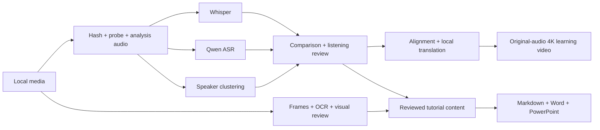

# Polyglot Media Workbench

[](https://github.com/KietC/polyglot-media-workbench/actions/workflows/ci.yml)
[](LICENSE)
[](pyproject.toml)

**Local multilingual dual-ASR, speaker diarization, visual review and original-audio learning media.**

[English](#english) · [简体中文](#简体中文) · [Setup / 配置](docs/SETUP.md) · [Troubleshooting / 排错](docs/TROUBLESHOOTING.md)

## English

### What it does

Polyglot Media Workbench turns local audio or video into inspectable recognition results, original-language Markdown and optional bilingual learning material. It keeps Whisper and Qwen results separately, flags disagreements, groups voices without identifying people, extracts original-size screen frames, and provides optional OCR, local visual interpretation, forced alignment, translation, 4K rolling captions, Word and PowerPoint export.

English and German stay in the original transcript. Cantonese stays in the source transcript; its learning captions can be rewritten in standard written Mandarin. Original audio is copied into study videos and compared after muxing. A new caption appears below the previous dialogue, which moves up rather than disappearing immediately.

This repository contains generic processing code, synthetic examples and a reusable agent skill. Supply your own media, models, reviewed text, glossary and images locally. Models are downloaded separately under their own licenses.

### Start here

1. Read [the exact setup order](docs/SETUP.md), including Python, FFmpeg, CUDA and model preparation.
2. Install only the components needed for your task.
3. Run `doctor`; resolve missing tools and the required models before inference.
4. Start with a short non-sensitive clip, then process the whole file.
5. Review marked text against the original audio before using it in a tutorial.

### Minimal installation

```bash
git clone https://github.com/KietC/polyglot-media-workbench.git
cd polyglot-media-workbench
python -m venv .venv
# Windows PowerShell:
# .\.venv\Scripts\Activate.ps1
# Linux/macOS:
# source .venv/bin/activate
python -m pip install --upgrade pip
python -m pip install -e .
media-workbench --help
```

The base CLI has no model dependencies. To run ASR, install a suitable PyTorch build **first**, then `python -m pip install -e ".[asr,diar]"`. Follow [SETUP.md](docs/SETUP.md) for exact commands and checks. GPU libraries must match your hardware; a driver showing a CUDA version does not prove that every Python library can load.

### First complete ASR run

Make a local copy of `config.example.json` named `local_config.json`, prepare the model folders listed in it, and run:

```bash
media-workbench --config local_config.json doctor
media-workbench --config local_config.json run --input input/example.wav --output outputs/example
```

The default sequence is `whisper → qwen → diar → fuse → export`. Add forced alignment with:

```bash
media-workbench --config local_config.json run --input input/example.wav --output outputs/example --stages whisper qwen diar fuse align export
```

Results include `source.json`, a 16 kHz mono analysis copy, separate recognizer JSON, voice segments, comparison units, a progress/error file and `transcript.md`. `editorial_status: pending` means the text still needs listening review. Empty or corrupt results fail visibly.

### Other commands

| Goal | Command |
|---|---|
| Highest available video/audio | `media-workbench download URL --output inputs/downloads` |
| Frames and OCR | `media-workbench frames --input input/video.mp4 --output outputs/frames --ocr` |
| Local screen interpretation | `media-workbench --config local_config.json vision --frames outputs/frames/frames.json` |
| Local translation | `media-workbench --config local_config.json translate --input outputs/example/fuse.json --output outputs/example/translated.json` |
| Editable Word/PPT/MD | `media-workbench documents --content examples/content.json --output outputs/documents` |
| 4K rolling captions | See the next example; use reviewed cue text and a bilingual font. |

```bash
media-workbench --config local_config.json study-video \
  --input input/example.wav --cues outputs/example/translated.json \
  --output outputs/example/study.mkv --font /path/to/bilingual-font.ttf \
  --assets examples/assets.json
```

PowerShell uses backticks for continuation; a single-line command works on every shell. With NVIDIA hardware you may add `--codec h264_nvenc`. AAC sources generally need MP4 to retain their priming metadata; PCM sources usually need MKV. [Troubleshooting](docs/TROUBLESHOOTING.md) explains both cases and why audio hashes matter.

### How the pieces fit



### Scope and validation

- The main CLI is configurable and has CPU-only synthetic tests in CI. [VALIDATION.md](docs/VALIDATION.md) records the actual release checks separately from general setup advice.
- GPU models and optional document layouts are not universally certified across operating systems. Visible uncertainty is retained; automatic agreement is not a guarantee of accuracy.
- Stage cache keys include input hash, model files, configuration, dependency versions, code and relevant upstream files. Model hashing can take time; it prevents a new model from silently reusing old text.
- The `recipes/` directory preserves more detailed historical algorithms as generic, annotated reference material. Use the main CLI for the documented setup path; inspect recipe prerequisites before running a recipe.
- The core is MIT licensed. Vendored 3D-Speaker files keep Apache-2.0 and upstream notices. See [third-party notices](THIRD_PARTY_NOTICES.md).

### Documentation

- [Configuration and complete operating order](docs/SETUP.md)
- [Pitfalls and concrete remedies](docs/TROUBLESHOOTING.md)
- [Architecture, files and schemas](docs/ARCHITECTURE.md)
- [Release validation](docs/VALIDATION.md)
- [Changelog](CHANGELOG.md)
- [README structure references](docs/README_DESIGN.md)
- [Agent skill](skills/asr-local-4in1/SKILL.md)
- [Contributing](CONTRIBUTING.md) · [Security](SECURITY.md)

## 简体中文

### 这个项目做什么

Polyglot Media Workbench将本地音视频处理为可核对的双路识别结果、原语言Markdown，以及可选的双语学习材料。它分别保存Whisper与Qwen识别，标记分歧，按声音分组而不猜人物身份，提取原尺寸画面，提供OCR、本地识图、强制对齐、翻译、4K滚动字幕，以及Word和PowerPoint生成。

英语、德语保留原文。粤语原话保留在底稿中，学习字幕可转普通话书面表达。学习视频复制原声音轨，封装后核对音频包和解码PCM；新对话放在下方，之前的对话向上移动，不会立即消失。

仓库只包含通用处理代码、合成示例与可复用skill。媒体、模型、审校正文、术语表和配图由使用者在本地提供。模型单独下载，适用各自许可。

### 正确开始顺序

1. 先阅读[详细配置顺序](docs/SETUP.md)，依次准备Python、FFmpeg、CUDA和模型。
2. 按任务安装所需模块，先装匹配的PyTorch，再装ASR等扩展。
3. 执行`doctor`，解决命令缺失和本任务所需模型缺失。
4. 用不敏感的短音频试跑，确认正常后处理完整文件。
5. 对照原声检查待核区间，之后再编写教程或学习字幕。

### 最小安装

```powershell
git clone https://github.com/KietC/polyglot-media-workbench.git
cd polyglot-media-workbench
python -m venv .venv
.\.venv\Scripts\Activate.ps1
python -m pip install --upgrade pip
python -m pip install -e .
media-workbench --help
```

基础CLI不加载模型。识别任务先安装适合本机的PyTorch，再执行`python -m pip install -e ".[asr,diar]"`。完整命令及验证方法见[SETUP.md](docs/SETUP.md)。`nvidia-smi`显示CUDA版本，不代表Python中的CUDA库一定可以加载。

### 第一次完整识别

将`config.example.json`复制为`local_config.json`，先下载并配置模型目录，再运行：

```powershell
media-workbench --config local_config.json doctor
media-workbench --config local_config.json run --input input/example.wav --output outputs/example
```

默认顺序为`Whisper → Qwen → 说话人分离 → 双路对照 → MD`。需要强制对齐时：

```powershell
media-workbench --config local_config.json run --input input/example.wav --output outputs/example --stages whisper qwen diar fuse align export
```

输出包括原媒体记录、16kHz单声道分析副本、两路识别JSON、声音分组、对照单元、进度/失败记录和`transcript.md`。`editorial_status: pending`表示仍需回听；空结果、损坏结果会报错。

### 后续处理

抽帧/OCR用`frames --ocr`；本地识图用`vision`；回环模型服务翻译用`translate`；统一审校正文用`documents`生成MD、Word和PPT。完整命令见上面的英文命令表及配置指南。

```powershell
media-workbench --config local_config.json study-video --input input/example.wav --cues outputs/example/translated.json --output outputs/example/study.mkv --font C:/Windows/Fonts/msyh.ttc --assets examples/assets.json
```

具有NVIDIA编码器时可加`--codec h264_nvenc`。AAC音源通常选MP4保留预卷信息；PCM音源通常选MKV。容器不匹配会导致复制失败或音频校验失败，见[排错说明](docs/TROUBLESHOOTING.md)。

### 使用与验收

主CLI采用配置项和输入、模型、参数、依赖、实现代码及上游内容共同绑定的缓存。模型文件哈希会耗时，目的是避免更换模型后误复用旧转写。CPU合成测试随CI执行，发布时实际验证范围见[VALIDATION.md](docs/VALIDATION.md)。

GPU模型及排版仍受系统、依赖、硬件和正文长度影响；待核标记保留在结果里。`recipes/`保存更完整的历史算法参考，运行前需检查其依赖。主代码MIT开源，第三方3D-Speaker保持Apache-2.0，模型各用各自许可。

配置、踩坑、结构、验收、skill和贡献说明均为英文在前、中文在后；具体入口见上面的Documentation链接。
